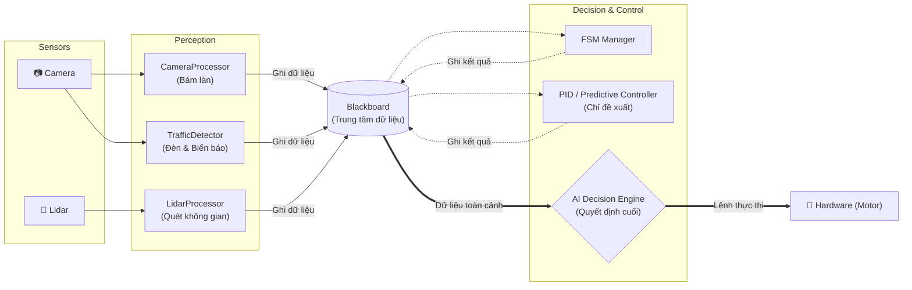
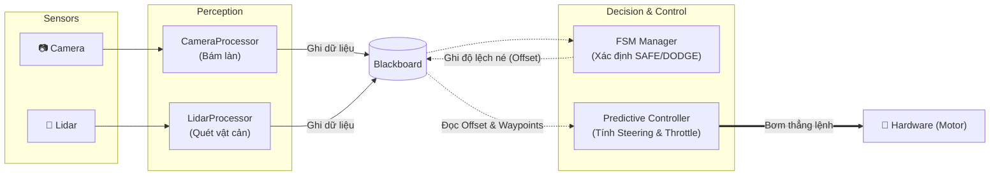
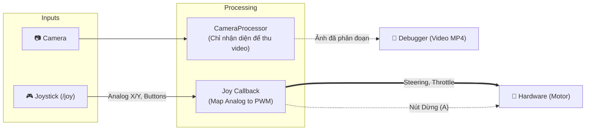

# Task Pipeline - Các Chế Độ Hoạt Động Của Robot

Tài liệu này mô tả chi tiết quy trình chạy (Pipeline) của 3 task chính trên Robot Jetson Nano, bao gồm các thành phần tham gia, thứ tự thực thi, và cách luồng dữ liệu di chuyển thông qua Blackboard.

---

## 1. Task: AI Navigation (`ros_ai_navigation.py`)

**Mục tiêu:** Di chuyển tự động thông minh (Tự lái Level 3+). Tuân thủ đèn giao thông, rẽ ngã tư theo chỉ dẫn của biển báo, bám làn đường.
**Luồng dữ liệu:** Đi qua bộ não AI (AI Decision Engine) để xét duyệt ưu tiên trước khi ra lệnh.

**Thứ tự Pipeline (20Hz):**
1. Lidar và Camera cập nhật frame liên tục.
2. `LidarProcessor`, `CameraProcessor`, `TrafficDetector` ghi nhận diện vào Blackboard.
3. `FSMManager` kiểm tra an toàn (hiện tại logic Lidar có thể đã giảm tải nhưng vẫn cập nhật State).
4. `Controller` tính toán góc lái bám làn và đề xuất vào Blackboard.
5. `AIDecisionEngine` đánh giá tổng thể (Đèn đỏ ưu tiên cao nhất -> Biển báo rẽ ưu tiên 2 -> Bám làn ưu tiên 3).
6. Gửi lệnh (`Throttle`, `Steering`) cho Motor.

---

## 2. Task: Speed Track (`ros_speed_track.py`)

**Mục tiêu:** Đua tốc độ cao trên sa hình. Phản xạ nhanh nhất có thể. Né vật cản tức thời, bám làn ở tốc độ cao. KHÔNG quan tâm đèn giao thông hay biển báo.
**Luồng dữ liệu:** Controller tính toán xong bơm thẳng lệnh xuống phần cứng (Low Latency).

**Thứ tự Pipeline (20Hz):**
1. Nhận dữ liệu Sensor -> Blackboard.
2. `FSMManager` nếu thấy vật cản sẽ sinh ra `dodge_offset_px` để làm lệch vạch ảo.
3. `PredictiveController` bám theo vạch ảo (đã bị lệch nếu đang né) -> Bơm ngay lệnh lái và ga xuống Motor.

---

## 3. Task: Joy Teleop (`ros_joy_teleop.py`)

**Mục tiêu:** Điều khiển thủ công bằng tay cầm (Gamepad/Joystick). Thu thập dữ liệu (Record Video, CSV) để phục vụ huấn luyện, hoặc gỡ lỗi Camera.
**Luồng dữ liệu:** Chuyển đổi tín hiệu Analog của Joystick thành lệnh Motor.

**Thứ tự Pipeline:**
1. User vặn Joystick (Analog X = Steering, Analog Y = Throttle).
2. Callback chuyển đổi giá trị sang dải `[-1.0, 1.0]`.
3. Nhấn nút A sẽ gửi `Throttle = 0` và `Steering = 0` ngay lập tức (Emergency Brake).
4. Đồng thời `CameraProcessor` vẫn chạy ngầm để sinh ra vạch kẻ đường, xuất ra `Debugger` ghi thành video `.mp4`.
