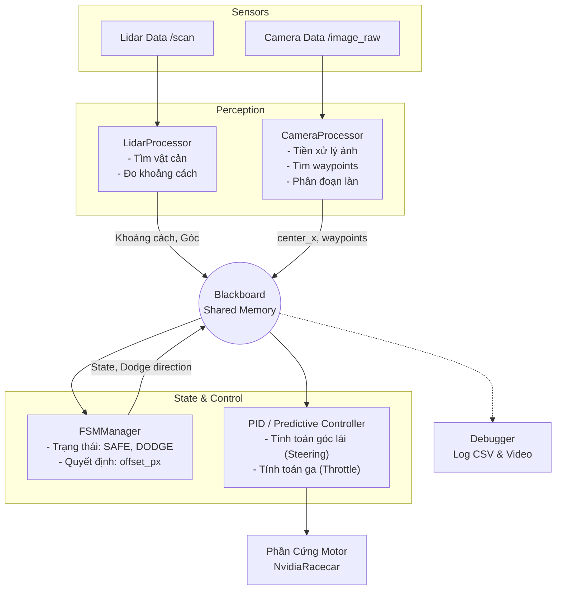
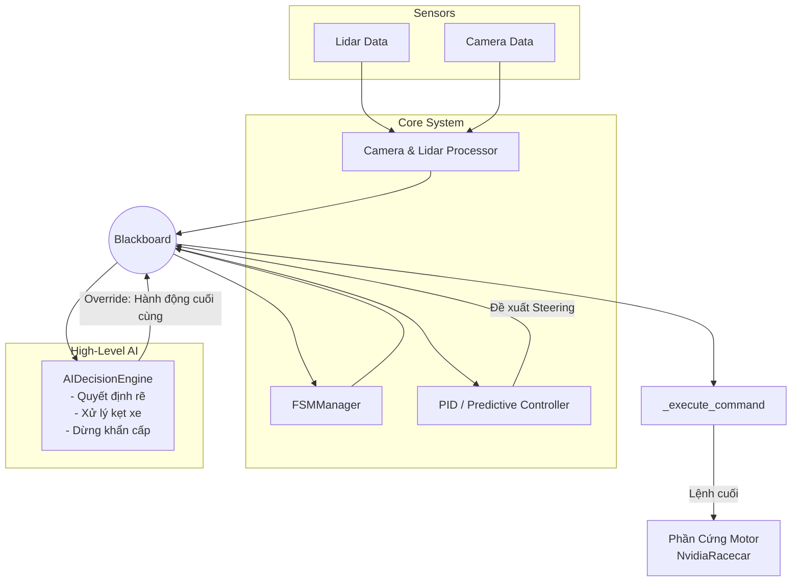

# Kiến Trúc Các Tasks Điều Khiển Robot

Tài liệu này mô tả luồng dữ liệu (Data Pipeline) và vòng đời thực thi của hai chương trình cốt lõi giúp điều khiển Robot Jetson Nano đua xe: `ros_speed_track` và `ros_ai_navigation`. Cả hai đều được thiết kế dựa trên mẫu kiến trúc **Blackboard Pattern** để trao đổi dữ liệu.

---

## 1. Task: Speed Track (`ros_speed_track.py`)

Đây là bộ điều khiển cơ bản, phản xạ nhanh và ổn định nhất. Phù hợp cho mục tiêu đua xe tốc độ cao trên đường đua có vạch kẻ sẵn.

### Sơ đồ Luồng Dữ Liệu (Pipeline)

**Cách hoạt động (20Hz):**
1. Lidar và Camera đổ dữ liệu liên tục vào Blackboard.
2. FSM đọc cảm biến, quyết định xem xe đang ở trạng thái SAFE (an toàn) hay DODGE (phải né vật cản).
3. Controller đọc trạng thái FSM và Waypoints từ Camera, tính toán góc Steering phù hợp và truyền thẳng xuống động cơ.

---

## 2. Task: AI Navigation (`ros_ai_navigation.py`)

Đây là hệ thống có "Não" cấp cao hơn. Thay vì chỉ phản xạ chạy theo vạch, nó có khả năng đưa ra các quyết định phức tạp như: rẽ ở ngã tư, lùi xe khi bị kẹt, hoặc dừng khẩn cấp.

### Sơ đồ Luồng Dữ Liệu (Pipeline)

**Cách hoạt động (20Hz):**
1. Hệ thống Perception và FSM và Controller chạy tương tự như `Speed Track`.
2. **Khác biệt cốt lõi:** Lệnh của Controller KHÔNG truyền trực tiếp xuống phần cứng.
3. Controller chỉ đóng vai trò "Đề xuất góc lái".
4. Khối `AIDecisionEngine` sẽ đánh giá toàn bộ bức tranh. 
   - Nếu điều kiện bình thường: Nó cho phép lệnh của Controller đi qua (FOLLOW_LANE).
   - Nếu gặp ngã tư / ngõ cụt: Nó sẽ ghi đè (override), tự tính toán góc lái và ga để bắt xe Rẽ trái/phải, Lùi, hoặc Đứng chờ.
5. Hàm `_execute_command` nhận lệnh cuối cùng từ AI và truyền xuống motor.
