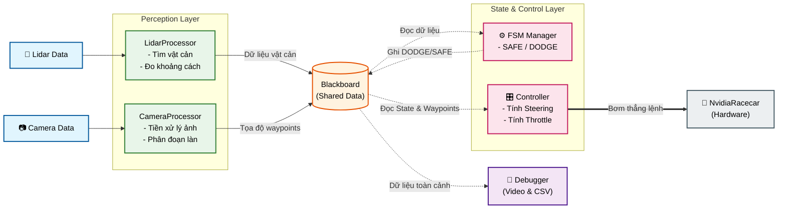
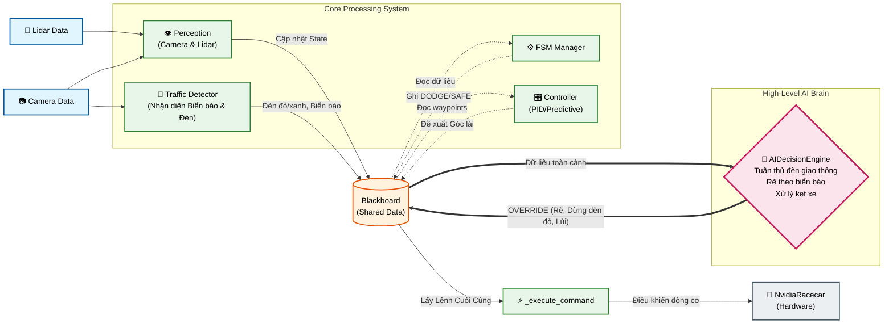

# Kiến Trúc Các Tasks Điều Khiển Robot

Tài liệu này mô tả luồng dữ liệu (Data Pipeline) và vòng đời thực thi của hai chương trình cốt lõi giúp điều khiển Robot Jetson Nano đua xe: `ros_speed_track` và `ros_ai_navigation`. Cả hai đều được thiết kế dựa trên mẫu kiến trúc **Blackboard Pattern** để trao đổi dữ liệu.

---

## 1. Task: Speed Track (`ros_speed_track.py`)

Đây là bộ điều khiển cơ bản, phản xạ nhanh và ổn định nhất. Phù hợp cho mục tiêu đua xe tốc độ cao trên đường đua có vạch kẻ sẵn.

### Sơ đồ Luồng Dữ Liệu (Pipeline)

**Cách hoạt động (20Hz):**
1. Lidar và Camera đổ dữ liệu liên tục vào Blackboard.
2. FSM đọc cảm biến, quyết định xem xe đang ở trạng thái SAFE (an toàn) hay DODGE (phải né vật cản).
3. Controller đọc trạng thái FSM và Waypoints từ Camera, tính toán góc Steering phù hợp và truyền thẳng xuống động cơ.

---

## 2. Task: AI Navigation (`ros_ai_navigation.py`)

Đây là hệ thống có "Bộ Não" AI cấp cao. Ngoài việc phản xạ chạy theo vạch, nó có khả năng đưa ra các quyết định phức tạp như: rẽ ở ngã tư theo chỉ dẫn của biển báo, dừng lại khi gặp đèn đỏ, lùi xe khi bị kẹt, hoặc dừng khẩn cấp.

### Sơ đồ Luồng Dữ Liệu (Pipeline)

**Cách hoạt động (20Hz):**
1. Hệ thống Perception và FSM và Controller chạy tương tự như `Speed Track`.
2. Bổ sung thêm khối **Traffic Detector** phân tích ảnh Camera độc lập, tìm kiếm Đèn Giao Thông và Biển Báo rồi ghi kết quả vào Blackboard.
3. Controller chỉ đóng vai trò "Đề xuất góc lái". Lệnh này KHÔNG truyền trực tiếp xuống phần cứng.
4. Khối **`AIDecisionEngine`** sẽ đánh giá toàn bộ bức tranh theo thứ tự ưu tiên (Priority Chain):
   - **Mức 1 (Khẩn cấp):** Dừng ngay lập tức nếu vật cản quá gần.
   - **Mức 2 (Đèn giao thông):** Nếu nhận thấy `ĐÈN ĐỎ`, ép dừng xe (`WAIT_RED_LIGHT`).
   - **Mức 3 (Vật cản):** Kẹt cứng thì đứng chờ, đợi lâu quá thì lùi xe. Né tránh nếu có chỗ trống.
   - **Mức 4 (Ngã tư & Biển báo):** Nếu thấy ngã tư, AI sẽ kiểm tra xem trước đó có nhận diện được biển báo chỉ dẫn không. Nếu có biển báo Rẽ Trái/Phải/Thẳng, AI sẽ ép xe đi theo hướng đó.
   - **Mức 5 (Mặc định):** Cho phép lệnh của Controller đi qua để bám làn bình thường (`FOLLOW_LANE`).
5. Hàm `_execute_command` nhận lệnh cuối cùng từ AI và truyền xuống motor.
