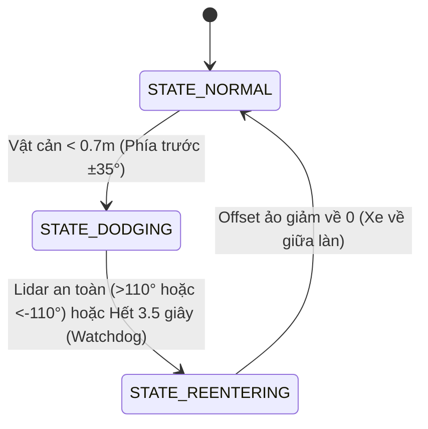

# 📘 Hướng Dẫn Kỹ Thuật Hệ Thống Điều Khiển Xe Tự Hành Speed Track

Tài liệu này tóm tắt toàn bộ nguyên lý hoạt động, thuật toán xử lý ảnh, cấu trúc FSM (Máy trạng thái), cách cài đặt và vận hành hệ thống điều khiển xe JetRacer tự động bám biên và né vật cản động.

---

## 1. TỔNG QUAN HỆ THỐNG PHẦN CỨNG & PHẦN MỀM

*   **Xe cơ sở:** Waveshare JetRacer Pro AI Kit (Jetson Nano 4GB).
*   **Cảm biến chính:**
    *   **Camera CSI:** Truyền luồng ảnh video thực tế góc nhìn từ mũi xe.
    *   **LiDAR:** Máy quét khoảng cách laser 360 độ dùng để xác định vật cản.
*   **Nền tảng giao tiếp:** ROS 1 Melodic kết hợp lập trình thuật toán bằng Python 3.
*   **Giao thức điều khiển động cơ:** Lệnh bẻ lái (steering) và tốc độ (throttle) được truyền trực tiếp xuống mạch điều khiển thông qua I2C của thư viện `PIDController`.

---

## 2. CÁC TRẠNG THÁI HOẠT ĐỘNG CỦA ROBOT (FSM STATES)
Hệ thống sử dụng một máy trạng thái hữu hạn (FSM) 3 trạng thái được chuyển đổi linh hoạt dựa trên dữ liệu LiDAR thời gian thực:



### 1️⃣ Trạng thái 1: BÁM LÀN BÌNH THƯỜNG (`STATE_NORMAL`)
*   **Mô tả:** Xe bám theo tâm đường đen nằm giữa 2 vạch biên trắng.
*   **Hành vi:** Dịch làn ảo bằng 0 (`target_offset_px = 0.0`). Bánh lái bám sát tâm đường thực tế.
*   **Điều kiện chuyển trạng thái:** Nếu phát hiện bất kỳ vật cản nào nằm trong hình nêm quét trước mặt ($\pm 35^\circ$) với khoảng cách gần hơn `TRIGGER_DIST` ($0.70$m) $\rightarrow$ Chuyển sang **STATE_DODGING**.

### 2️⃣ Trạng thái 2: NÉ TRÁNH VẬT CẢN (`STATE_DODGING`)
*   **Mô tả:** Xe chủ động đánh lái lách sang một bên để tránh va chạm.
*   **Cơ chế xác định hướng né:**
    *   Nếu góc lệch của vật cản so với mũi xe là âm (vật cản lệch phải) $\rightarrow$ Xe né sang **TRÁI** (`dodge_direction = -1.0`, dịch vạch ảo sang trái `-70` pixel).
    *   Nếu góc lệch của vật cản so với mũi xe là dương (vật cản lệch trái) $\rightarrow$ Xe né sang **PHẢI** (`dodge_direction = 1.0`, dịch vạch ảo sang phải `+70` pixel).
*   **Cơ chế dịch chuyển mượt mà (Ramping):** Không dịch đột ngột tránh lật xe. Offset tăng/giảm tuần tự 5 pixel/frame.
*   **Cơ chế Watchdog:** Nếu xe bị kẹt góc nhìn LiDAR hoặc nhận nhầm tường phòng dẫn đến việc không thể xác nhận đã vượt qua vật cản, bộ giám sát Watchdog sẽ tự động kích hoạt sau **3.5 giây** để đưa xe về trạng thái trả lái nhằm tránh đâm biên.
*   **Điều kiện chuyển trạng thái:** Khi vật cản lùi sâu về phía sau hông xe (góc quét sườn $> 110^\circ$ hoặc $< -110^\circ$, khoảng cách $> SIDE\_CLEAR\_DIST$) liên tiếp trong **8 frames** (chống nhiễu) HOẶC hết 3.5 giây Watchdog $\rightarrow$ Chuyển sang **STATE_REENTERING**.

### 3️⃣ Trạng thái 3: NHẬP LẠI LÀN CŨ (`STATE_REENTERING`)
*   **Mô tả:** Xe lướt nhẹ nhàng quay trở lại làn chính diện sau khi đã vượt qua vật cản.
*   **Hành vi:** Thu dần độ lệch vạch ảo về 0 (`target_offset_px = 0.0`).
*   **Điều kiện chuyển trạng thái:** Khi độ lệch ảo thực tế `current_offset_px` giảm xuống dưới $1.0$ pixel (xe đã hoàn toàn nằm ở tâm làn ban đầu) $\rightarrow$ Trở về **STATE_NORMAL**.

---

## 3. NGUYÊN LÝ HOẠT ĐỘNG & THUẬT TOÁN CỐT LÕI

### 📷 3.1. Thuật toán Xử lý ảnh bám làn (Lane Detection)
Mỗi khung hình từ camera được xử lý qua pipeline:
1.  **Tiền xử lý:** Resize ảnh về kích thước chuẩn $300 \times 300$, chuyển sang ảnh xám và nhị phân hóa bằng ngưỡng xám ($180$) để tách vạch trắng biên đường.
2.  **Phân cụm vạch (Segment Clustering):** Quét toàn bộ dòng quét ngang. Gom các điểm trắng liền kề (khoảng cách $\le 15$ pixel) thành các cụm biên độc lập để tránh nhiễu đứt nét.
3.  **Nhận dạng vạch dựa theo trạng thái (State-Aware Classification):**
    *   Nếu nhìn thấy từ 2 vạch trở lên: Lấy vạch ngoài cùng bên trái làm `left_border`, vạch ngoài cùng bên phải làm `right_border`.
    *   Nếu chỉ nhìn thấy **1 vạch duy nhất** do xe bị lệch quá sâu:
        *   Nếu xe đang né sang trái (`dodge_direction = -1`): Vạch này bắt buộc là **biên trái**.
        *   If xe đang né sang phải (`dodge_direction = 1`): Vạch này bắt buộc là **biên phải**.
    *   *Mục đích:* Giải quyết triệt để lỗi "phản hồi dương" khi xe chạy lệch biên và nhận dạng nhầm vạch.
4.  **Tái cấu trúc biên đơn & Hiệu chuẩn thích nghi:**
    *   Nếu có đủ 2 biên: Cập nhật chiều rộng đường thực tế $\text{estimated\_lane\_width}$ bằng bộ lọc EMA.
    *   Nếu mất 1 biên: Dựng biên ảo đối diện dựa trên $\text{estimated\_lane\_width}$ để tính toán chính xác tâm đường $\text{center\_x}$.
    *   Nếu mất cả 2 biên: Dùng hướng lệch gần nhất $\text{last\_known\_direction}$ đánh lái nhẹ ngược lại để kéo xe quay về sa bàn.

### 🎮 3.2. Thuật toán Điều khiển góc lái
*   Tính sai số giữa tâm lòng đường mục tiêu và tâm xe (giữa ảnh $150$px):
    $$\text{error\_px} = (\text{center\_x} + \text{current\_offset\_px}) - 150$$
*   Sử dụng bộ điều khiển Tỷ lệ (P Controller) với hệ số độ nhạy $K_p = 0.007$ để xuất góc lái:
    $$\text{steering} = \text{error\_px} \times K_p$$
    *(Góc lái được giới hạn vật lý từ -1.0 đến 1.0)*

---

## 4. PHƯƠNG ÁN CÀI ĐẶT & VẬN HÀNH TRÊN XE

### 🛠️ 4.1. Cài đặt môi trường một lần duy nhất
Đăng ký biến môi trường ROS tự động vào bash của xe để không cần gõ lệnh `source` nhiều lần:
```bash
echo "source /opt/ros/melodic/setup.bash" >> ~/.bashrc
echo "source ~/catkin_ws/devel/setup.bash" >> ~/.bashrc
source ~/.bashrc
```

Sao chép gói phần cứng `jetracer_ros` vào workspace hiện tại và biên dịch:
```bash
cp -r ~/catkin_ws_old/src/jetracer_ros ~/catkin_ws/src/
cd ~/catkin_ws && catkin_make
source devel/setup.bash
```

### 🏎️ 4.2. Quy trình khởi chạy chạy xe (Chỉ dùng 2 Tab Terminus)

*   **Tab 1 (Bật tất cả cảm biến LiDAR + Camera):**
    ```bash
    roslaunch src/speed_track/sensors.launch
    ```
*   **Tab 2 (Chạy thuật toán Speed Track điều khiển xe):**
    ```bash
    python3 src/speed_track/main_speed_track.py
    ```

---

## 5. CÔNG CỤ DEBUG CHUYÊN NGHIỆP

1.  **Video Debug tích hợp Radar 2D (`speed_track_run.avi`):**
    *   Mỗi frame video được chèn thêm vòng radar 80x80 pixel ở góc phải hiển thị thời gian thực các chùm tia quét của LiDAR. Điểm màu Đỏ là vật cản đang bị phát hiện nguy hiểm, màu Xanh lá là an toàn.
2.  **Log Dữ liệu Hành trình CSV (`speed_track_debug.csv`):**
    *   Lưu thông số sau mỗi chu kỳ 50ms bao gồm: `timestamp`, `state`, `front_dist`, `closest_angle`, `closest_dist`, `current_offset_px`, `steering` để vẽ đồ thị chẩn đoán lỗi.
