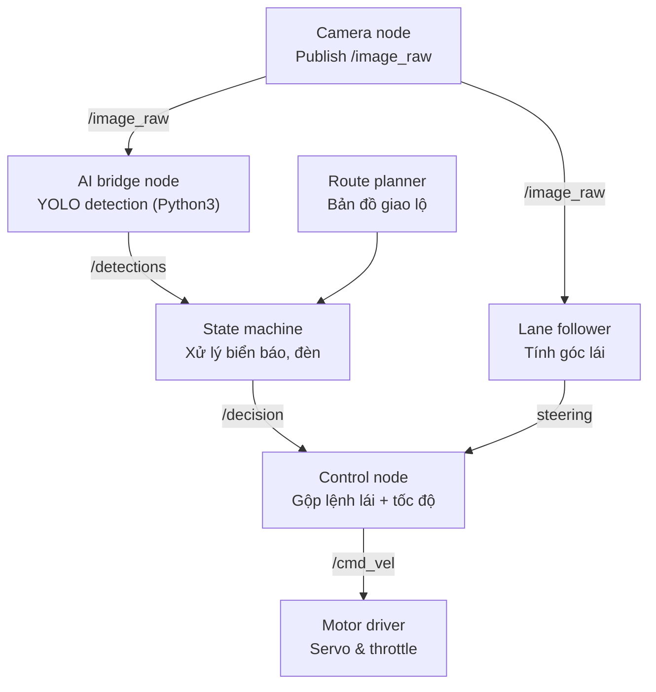

# Kiến trúc Code — Bài 2: Smart City
## Jetson AI Racer Challenge 2026 (ROS-based, YOLOv5n TensorRT)

---

## 1. Sơ đồ luồng dữ liệu



- **Perception** (Camera node, AI bridge node): thu ảnh và chạy detection.
- **Decision** (State machine, Route planner): xử lý biển báo/đèn và tra bản đồ giao lộ để chọn hướng.
- **Control** (Lane follower, Control node): giữ làn khi đang chạy thẳng và gộp lệnh với quyết định rẽ/dừng, xuất `/cmd_vel` cho motor driver.

---

## 2. Cây thư mục

```
jetracer_smartcity/
├── catkin_ws/src/
│   ├── jetracer_smartcity/
│   │   ├── launch/
│   │   │   └── smartcity.launch
│   │   ├── config/
│   │   │   ├── camera_config.yaml        # resolution, fps, calibration
│   │   │   ├── model_config.yaml         # engine path, input size, conf/nms threshold, class map
│   │   │   └── intersection_map.yaml     # graph: nodes (giao lộ), edges, hướng bắt buộc/cấm, vùng finish
│   │   ├── msg/
│   │   │   ├── Detection.msg             # label, confidence, bbox(x,y,w,h)
│   │   │   ├── DetectionArray.msg        # header + Detection[]
│   │   │   └── IntersectionDecision.msg  # decision(str), node_id, latency_ms
│   │   ├── scripts/
│   │   │   ├── ai_bridge_node.py         # node python3: subscribe /image_raw, gọi detector, publish /detections
│   │   │   ├── perception/
│   │   │   │   ├── detector.py           # class YoloDetector: load engine, preprocess, infer(TensorRT), NMS, trả list detections
│   │   │   │   └── traffic_light_state.py# fallback HSV crop để xác định màu đèn khi conf YOLO thấp
│   │   │   ├── state_machine/
│   │   │   │   ├── route_planner.py      # đọc intersection_map.yaml, BFS/Dijkstra tìm path start->finish
│   │   │   │   └── intersection_state_machine.py
│   │   │   │       # states: CRUISING -> APPROACH_NODE -> WAIT_SIGNAL -> DECIDE_DIRECTION -> EXECUTE_TURN -> CRUISING
│   │   │   │       # subscribe /detections, publish /decision (IntersectionDecision)
│   │   │   ├── control/
│   │   │   │   ├── lane_follower.py      # xử lý ảnh (mask làn/edge) -> steering_angle khi đang CRUISING
│   │   │   │   └── control_node.py       # nhận /decision + /steering_angle -> tính throttle/servo -> publish /cmd_vel
│   │   │   └── utils/
│   │   │       ├── image_utils.py        # resize, normalize, convert BGR->RGB, letterbox
│   │   │       ├── run_logger.py         # ghi log CSV theo schema mục 7 đề bài
│   │   │       └── config_loader.py      # load yaml config dùng chung
│   │   └── package.xml / CMakeLists.txt
│   └── jetracer_py3_bridge/              # chỉ cần nếu rospy python3 không cài được trực tiếp
│       └── scripts/zmq_bridge.py         # forward ảnh qua ZeroMQ giữa node py2 (camera driver gốc) và node py3 (AI)
├── training/
│   ├── dataset/                          # (gitignore, không commit ảnh thật của sa bàn)
│   ├── train_yolov5n.ipynb               # train trên Colab
│   ├── export_onnx.py                    # export weights -> onnx (opset tương thích TensorRT7.1)
│   └── export_tensorrt.sh                # onnx -> .engine trên chính Jetson (FP16)
├── models/
│   └── yolov5n_smartcity.engine
└── logs/
```

---

## 3. Mô tả chi tiết chức năng từng file

### `ai_bridge_node.py`
- Node ROS chạy Python3, subscribe `/image_raw`, gọi `YoloDetector.infer()`, publish `/detections` (`DetectionArray`).
- Là điểm cầu nối bắt buộc vì ROS Melodic mặc định dùng Python2, còn model AI dùng Python3.

### `detector.py`
- `load_engine(path)`: load TensorRT engine đã build sẵn trên Jetson (không convert onnx→engine ở runtime).
- `preprocess(frame)`: resize về input size model (vd 320×320), letterbox, normalize.
- `infer(frame)`: chạy inference, trả raw output.
- `postprocess(output, conf_thres, nms_thres)`: decode box, lọc theo confidence, áp NMS, trả `[{label, conf, bbox}]`.

### `traffic_light_state.py`
- `crop_light_region(frame, bbox)`: cắt vùng đèn theo bbox YOLO trả về.
- `classify_color(crop)`: dùng HSV threshold xác định đỏ/xanh, làm lớp bảo hiểm khi model nhầm màu đèn do ánh sáng sa bàn thay đổi.

### `route_planner.py`
- `load_map(yaml_path)`: parse đỉnh/cạnh/hướng cấm–bắt buộc từ `intersection_map.yaml`.
- `find_path(start_node, finish_node)`: BFS/Dijkstra trả list node cần đi qua.
- `get_required_direction(current_node, next_node)`: trả "straight/left/right" tương ứng cạnh trong path.

### `intersection_state_machine.py`
- `on_detection(msg)`: callback nhận `/detections`, cập nhật state.
- `handle_sign(detection)`: biển lệnh → ép hướng X; biển cấm → loại hướng bị cấm khỏi lựa chọn của route_planner.
- `handle_light(color)`: đèn đỏ → publish decision STOP, giữ tới khi xanh.
- `decide_direction()`: gọi route_planner lấy hướng đúng, publish `IntersectionDecision`.
- `publish_decision(decision)`.

### `lane_follower.py`
- `get_lane_mask(frame)`: threshold màu/edge detect line trắng đứt.
- `compute_steering(mask)`: tính centroid lệch tâm → góc lái, dùng khi đang chạy giữa 2 giao lộ.

### `control_node.py`
- `on_decision(msg)`: chuyển state STOP/TURN_LEFT/... thành lệnh cụ thể (servo angle, throttle).
- `execute_turn(direction)`: chuỗi lệnh lái ngắn (open-loop) để xe rẽ qua giao lộ, sau đó trả quyền lại cho lane_follower.
- `publish_cmd(throttle, steering)`.

### `run_logger.py`
- `log_event(timestamp, fps, detected_object, confidence, decision, latency_ms, control_output, event)`: ghi 1 dòng CSV đúng schema BTC yêu cầu (mục 7 đề bài), phục vụ đối chiếu tranh chấp và kiểm tra latency ≤300ms.

---

## 4. Đề xuất model detection

**Chọn: YOLOv5n (nano), input 320×320, xuất TensorRT FP16**

Lý do phù hợp phần cứng (Jetpack 4.5.1, CUDA 10.2 → TensorRT ~7.1):

- YOLOv5n là bản nhẹ nhất dòng YOLOv5, pipeline export ONNX ổn định với opset cũ (11–12), tương thích tốt với TensorRT 7.x — khác YOLOv8/YOLO11 vốn cần TensorRT 8+ và dễ lỗi khi convert trên Jetpack cũ.
- Input nhỏ (320×320 thay vì 640) giúp giữ FPS ≥20 (yêu cầu mục 3.6) trên Jetson yếu.
- Gộp toàn bộ class (biển lệnh trái/phải/thẳng, biển cấm trái/phải/thẳng, đèn đỏ, đèn xanh) vào 1 model detection duy nhất, giảm số lần inference/frame — quan trọng để giữ latency ≤300ms (mục 4.9).
- Có backup rule-based (`traffic_light_state.py`) cho màu đèn, vì đèn dễ bị model nhầm màu khi ánh sáng sa bàn thay đổi — dùng YOLO định vị bbox đèn, dùng HSV xác nhận màu.

**Quy trình convert bắt buộc:**
1. Train YOLOv5n trên Colab (không train trên xe).
2. Export ONNX với `--opset 11`.
3. Convert ONNX → TensorRT `.engine` **ngay trên chính Jetson** (không copy engine giữa các board khác kiến trúc), dùng `trtexec --fp16`.
4. Benchmark FPS thực tế trên xe trước khi thi, vì FPS trên Colab/laptop không phản ánh đúng Jetson.
